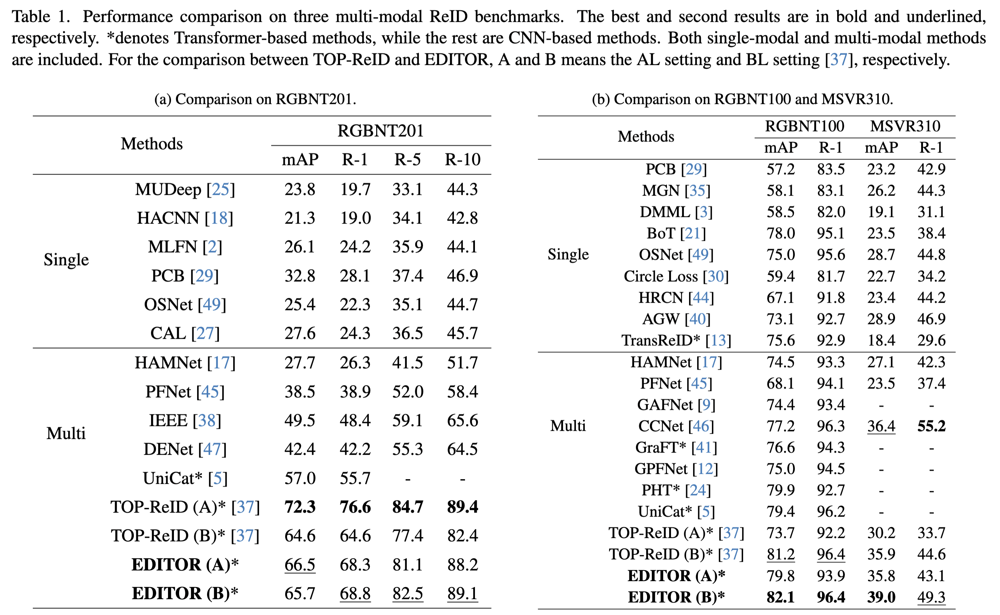
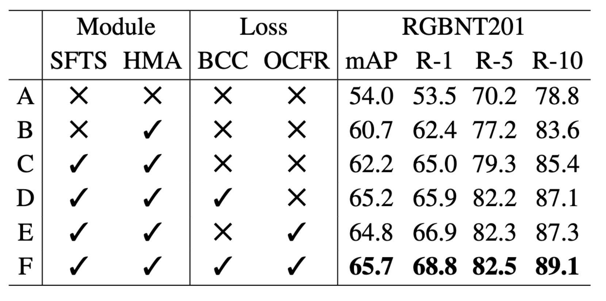
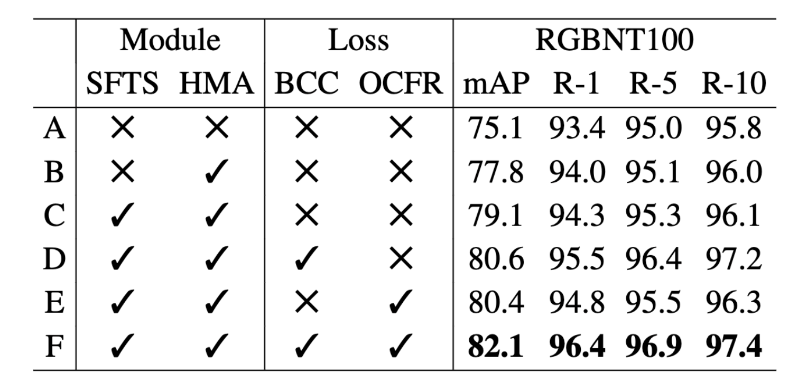
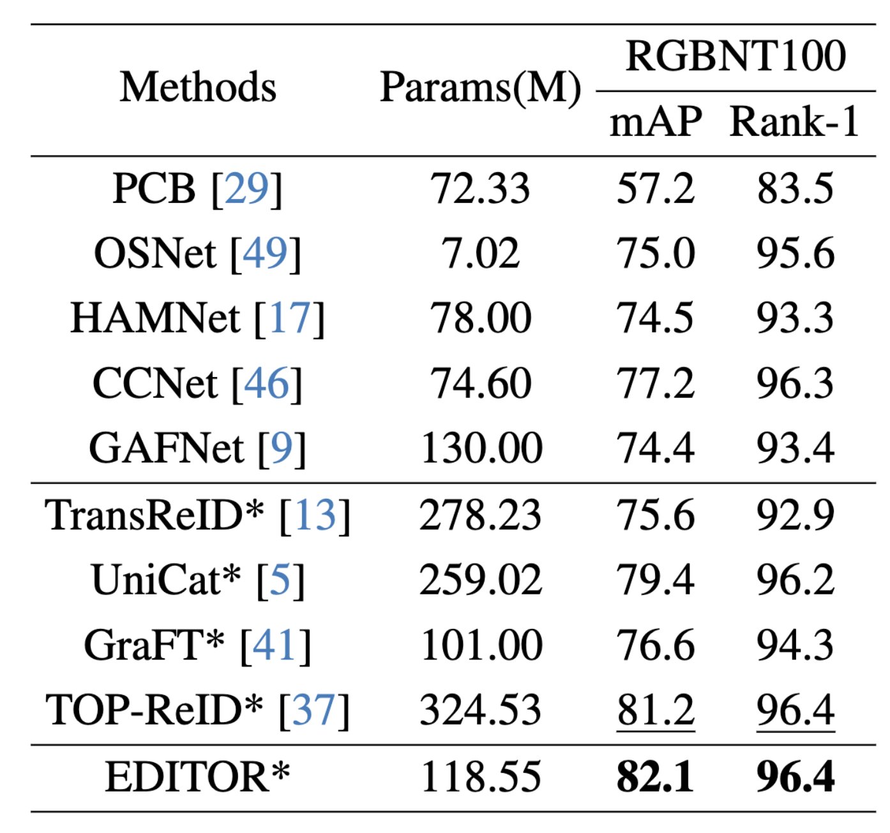
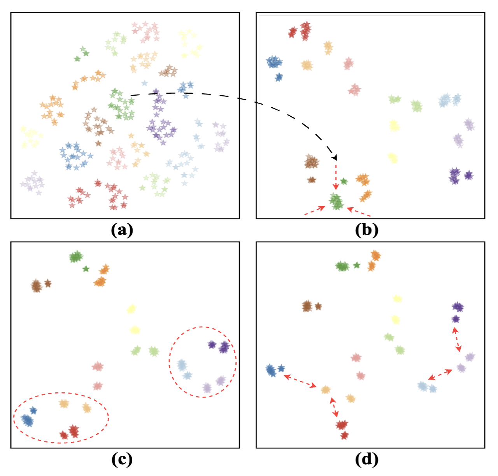
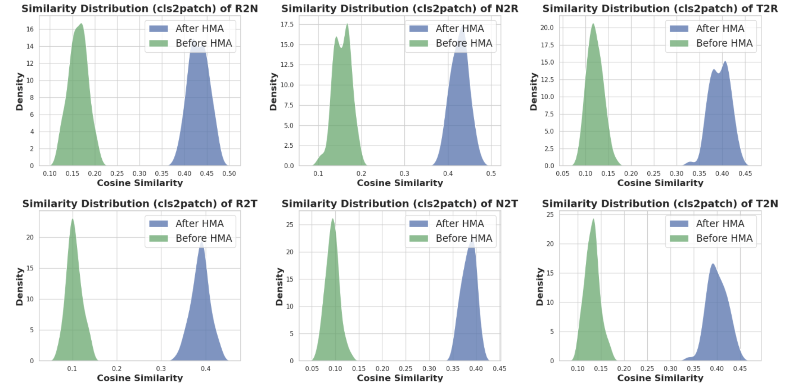
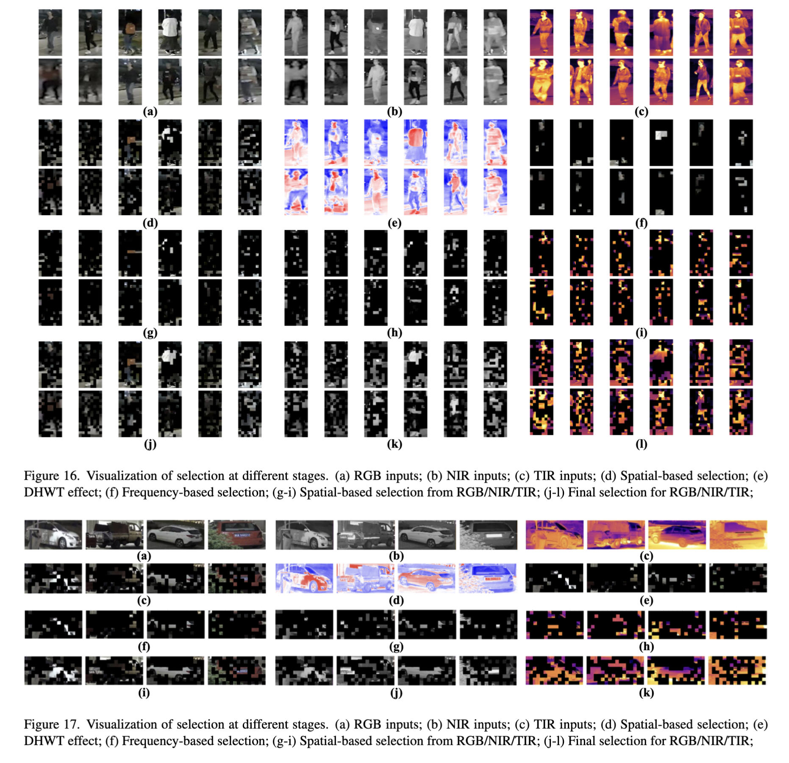

<p align="center">
  <h1 align="center">Magic Tokens: Select Diverse Tokens for Multi-modal Object Re-Identification</h1>
  <p align="center">
    
  <p align="center">
    <a href="https://scholar.google.com/citations?user=MfbIbuEAAAAJ&hl=zh-CN" rel="external nofollow noopener" target="_blank"><strong>Pingping Zhang*</strong></a>
    ·
    <a href="https://scholar.google.com/citations?user=WZvjVLkAAAAJ&hl=zh-CN" rel="external nofollow noopener" target="_blank"><strong>Yuhao Wang</strong></a>
    ·
    <a href="https://dblp.org/pid/51/3710-66.html" rel="external nofollow noopener" target="_blank"><strong>Yang Liu</strong></a>
    ·
    <a href="https://dblp.org/pid/138/5016.html" rel="external nofollow noopener" target="_blank"><strong>Zhengzheng Tu</strong></a>
    ·
    <a href="https://scholar.google.com/citations?hl=zh-CN&user=D3nE0agAAAAJ" rel="external nofollow noopener" target="_blank"><strong>Huchuan Lu</strong></a>
  </p>
<p align="center">
    <a href="https://arxiv.org/abs/2403.10254" rel="external nofollow noopener" target="_blank">CVPR 2024 Paper</a>


Previous methods may be easily affected by irrelevant backgrounds and usually ignore the modality gaps. 
To address above issues, we propose a novel learning framework named **EDITOR** to s**E**lect **DI**verse **T**okens for multi-modal **O**bject **R**eID. 
**EDITOR** prioritizes the selection of object-centric information, aiming to preserve the diverse features of different modalities while minimizing background interference. 
Our proposed **EDITOR** achieves competitive performance on three multi-modal object ReID benchmarks, i.e., RGBNT201, RGBNT100 and MSVR310.

## News
Exciting news! Our paper has been accepted by the CVPR 2024! 🎉

## Table of Contents

- [Introduction](#introduction)
- [Contributions](#contributions)
- [Results](#results)
- [Visualizations](#visualizations)
- [Reproduction](#reproduction)
- [Citation](#citation)


## Introduction

Multi-modal object ReID is crucial in scenarios where objects are captured through different image spectra, such as RGB, near-infrared, and thermal imaging. 
Previous multi-modal ReID methods typically adhere to the approach of extracting global features from all regions of images in different modalities and subsequently aggregating them. Nevertheless, these methods present two key limitations: 
(1) Within individual modalities, backgrounds introduce additional noise, especially in challenging visual environments. 
(2) Across different modalities, backgrounds introduce overhead in reducing modality gaps, which may amplify the difficulty in aggregating features. 
Hence, our method prioritizes the selection of object-centric information, aiming to preserve the diverse features of different modalities while minimizing background interference.

## Contributions
- We introduce EDITOR, a novel learning framework for multi-modal object ReID. To our best knowledge, EDITOR represents the first attempt to enhance multi-modal object ReID through object-centric token selection.
- We propose a Spatial-Frequency Token Selection (SFTS) module and a Hierarchical Masked Aggregation (HMA) module. These modules effectively facilitate the selection and aggregation of multi-modal tokenized features.
- We propose two new loss functions with a Background Consistency Constraint (BCC) and an Object-Centric Feature Refinement (OCFR) to improve the feature discrimination with background suppressions.
- Extensive experiments are performed on three multi-modal object ReID benchmarks. The results fully validate the effectiveness of our proposed methods.

## Results
### Multi-modal Object ReID


### Performance comparison with different modules [RGBNT201、RGBNT100]

  

### Parameter Analysis of EDITOR [RGBNT100]


## Visualizations
### T-SNE


### Similarity



### Selection


#### Please check the paper for detailed information

## Reproduction
### Datasets
RGBNT201    link: https://drive.google.com/drive/folders/1EscBadX-wMAT56_It5lXY-S3-b5nK1wH  
Market1501-MM link: https://drive.google.com/drive/folders/1EscBadX-wMAT56_It5lXY-S3-b5nK1wH  
RGBNT100    link: https://pan.baidu.com/s/1xqqh7N4Lctm3RcUdskG0Ug  code：rjin  
MSVR310     link: https://pan.baidu.com/s/1soWMH10DyGG0krTKL7fsYg  code: p6ch
### Pretrained
ViT-B    link: https://pan.baidu.com/s/1YE-24vSo5pv_wHOF-y4sfA  code: vmfm

### Configs
RGBNT201    file: `EDITOR/configs/RGBNT201/EDITOR.yml`  
Market1501-MM file: `EDITOR/configs/Market1501-MM/EDITOR.yml`  
RGBNT100    file: `EDITOR/configs/RGBNT100/EDITOR.yml`  
MSVR310     file: `EDITOR/configs/MSVR310/EDITOR.yml`

### Tips
Please ensure that your batch size matches the one specified in the configuration file. Typically, using a batch size of 128 and a number of instances of 16 is more robust compared to using a batch size of 64/32 and a number of instances of 8. However, it's important to note that a batch size of 128 consumes over 24GB of GPU memory. In future work, we will pay attention to GPU memory consumption to provide convenient reproducible configurations for more researchers! Thank you for your attention!

### Bash
```bash
# python = 3.8
# cuda = 11.4
#!/bin/bash
source activate (your env)
cd ../(your path)
pip install -r requirements.txt
python train_net.py --config_file ../RGBNT201/EDITOR.yml
```
## Star History

[](https://star-history.com/#924973292/EDITOR&Date)

## Citation
If you find EDITOR useful in your research, please consider citing:
```bibtex
@InProceedings{Zhang_2024_CVPR,
    author    = {Zhang, Pingping and Wang, Yuhao and Liu, Yang and Tu, Zhengzheng and Lu, Huchuan},
    title     = {Magic Tokens: Select Diverse Tokens for Multi-modal Object Re-Identification},
    booktitle = {Proceedings of the IEEE/CVF Conference on Computer Vision and Pattern Recognition (CVPR)},
    month     = {June},
    year      = {2024},
    pages     = {17117-17126}
}
